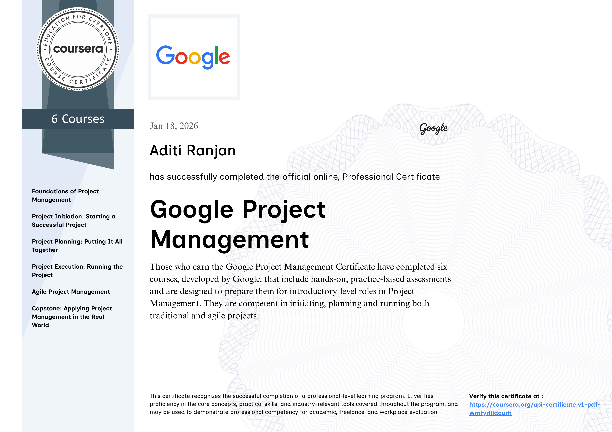

<p align="center">


</p>

<h1 align="center">

Aditi Ranjan

</h1>

<h3 align="center">

Supply Chain & Procurement Professional • Aspiring Product Manager

</h3>

<p align="center">


</p>

<p align="center">

<a href="https://aditi-ranjan-portfolio.framer.website/">


</a>

<a href="https://www.linkedin.com/in/aditi-ranjan-51780b255/">


</a>

<a href="mailto:aditiranjan80@gmail.com">


</a>


</p>

---

# 👋 Hello!

I'm **Aditi Ranjan**, a **Supply Chain Management Trainee at Labotek Technologies Pvt. Ltd.**

I enjoy solving operational challenges using structured processes, collaboration and data.

My long-term goal is to become a **Project Manager** and eventually transition into **Product Management**, where I can combine technology, business strategy and operational excellence.

---

# 💼 Experience

<table>

<tr>

<td width="35%">

## 🏢 Company

**Labotek Technologies Pvt. Ltd.**

Supply Chain Management Trainee

</td>

<td width="65%">

### Responsibilities

📦 Procurement

📄 Purchase Orders

🤝 Vendor Coordination

📊 Excel Reporting

📁 Documentation

🚚 Inventory Support

📈 Business Operations

👥 Cross Functional Teams

</td>

</tr>

</table>

---

# 🚀 Core Expertise

<p align="center">


</p>

---

# 💻 Business Toolkit

<p align="center">


</p>

<p align="center">


</p>

---

# 📚 Currently Learning

| | |
|---|---|
| 📈 SQL | 📦 SAP ERP |
| 📊 Power BI | 📋 Microsoft Project |
| 🏃 Agile | 🔄 Scrum |
| 🎯 Product Management | ⚡ Advanced Excel |

---

# 🎯 Career Vision

```text

Supply Chain

      ↓

Procurement

      ↓

Project Coordination

      ↓

Project Management

      ↓

Product Management

      ↓

Business Leadership

```

---
# 🏆 Certifications

> *Continuous learning is a key part of my professional journey.*

<p align="center">

<a href="#">

</a>

<a href="#">

</a>

<a href="#">

</a>

</p>

<p align="center">
<i>Add new certificates anytime by uploading images into the <b>certificates</b> folder.</i>
</p>

---

# 📊 Professional Snapshot

<table>

<tr>

<td align="center" width="25%">

### 📦

**Procurement**

</td>

<td align="center" width="25%">

### 📈

**Analytics**

</td>

<td align="center" width="25%">

### 🤝

**Operations**

</td>

<td align="center" width="25%">

### 🚀

**Leadership**

</td>

</tr>

</table>

---

# 🌱 Currently Exploring

<table>

<tr>

<td>

### Business

- Product Management
- Business Strategy
- Stakeholder Management
- Project Coordination

</td>

<td>

### Technology

- SQL
- Power BI
- SAP ERP
- Automation

</td>

</tr>

</table>

---

# 🔥 GitHub Streak

<p align="center">


</p>

---

# 📉 Activity Graph

<p align="center">


</p>

---

# 💬 Philosophy

<p align="center">

> **"Strong operations build stronger businesses. Every successful product begins with an efficient process."**

</p>

---

# 🤝 Let's Connect

<p align="center">

<a href="https://aditi-ranjan-portfolio.framer.website/">


</a>

<a href="https://www.linkedin.com/in/aditi-ranjan-51780b255/">


</a>

<a href="mailto:aditiranjan80@gmail.com">


</a>

</p>

---

<p align="center">


</p>
