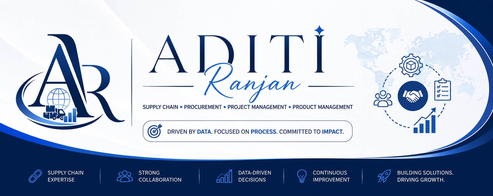

<p align="center">

</p>

<h1 align="center">

</h1>

<p align="center">

<a href="https://aditi-ranjan-portfolio.framer.website/">

</a>

<a href="https://www.linkedin.com/in/aditi-ranjan-51780b255/">

</a>

<a href="mailto:aditiranjan80@gmail.com">

</a>


</p>

---

# 👋 About Me

I'm **Aditi Ranjan**, a **Supply Chain Management Trainee at Labotek Technologies Pvt. Ltd.** with hands-on experience in procurement, vendor coordination, inventory support, purchase order management, business documentation and Excel reporting.

I enjoy improving operational efficiency through structured workflows, collaboration and data-driven decision making. My long-term goal is to build a career in **Project Management** and eventually **Product Management**, combining technology, business strategy and operations.

---

# 💼 Current Experience

## 🏢 Labotek Technologies Pvt. Ltd.

**Supply Chain Management Trainee**

### Key Responsibilities

- 📦 Procurement Operations
- 🤝 Vendor Coordination
- 📄 Purchase Order Tracking
- 📊 Excel Reporting
- 📁 Documentation
- 📦 Inventory Support
- 👥 Stakeholder Communication
- 🔄 Cross-functional Collaboration

---

# 🚀 Professional Interests

- Supply Chain Management
- Procurement
- Project Coordination
- Project Management
- Product Management
- Business Operations
- Business Analytics
- Dashboard Reporting
- Process Improvement
- Operational Excellence
- Digital Transformation

---

# 💻 Business Tech Stack

<p align="center">


</p>

---

# 📈 Excel & Analytics

✅ Pivot Tables

✅ XLOOKUP

✅ VLOOKUP

✅ SUMIFS

✅ COUNTIFS

✅ Conditional Formatting

✅ Dashboards

✅ Charts

✅ Data Validation

---

# 📚 Currently Learning

<p align="center">


</p>

---

# 🎯 Career Vision

```text
Supply Chain
      │
      ▼
Procurement
      │
      ▼
Project Coordination
      │
      ▼
Project Management
      │
      ▼
Product Management
      │
      ▼
Business Leadership
```

---

# 🏆 Certificates

> Upload your certificate images inside a folder named **certificates**.

<p align="center">


</p>

---

# 📊 GitHub Analytics

<p align="center">


</p>

---

# 🔥 GitHub Streak

<p align="center">


</p>

---

# 📈 Contribution Graph

<p align="center">


</p>

---

# 🌟 Professional Values

- 📊 Data-Driven Decisions
- 📈 Continuous Improvement
- 🤝 Collaboration
- 🎯 Ownership
- ⚡ Process Optimization
- 📚 Lifelong Learning

---

# 💬 Philosophy

> **"Strong operations create strong products. Every improvement begins with understanding the process."**

---

# 📬 Connect With Me

<p align="center">

<a href="https://aditi-ranjan-portfolio.framer.website/">

</a>

<a href="https://www.linkedin.com/in/aditi-ranjan-51780b255/">

</a>

<a href="mailto:aditiranjan80@gmail.com">

</a>

</p>

<p align="center">


</p>
